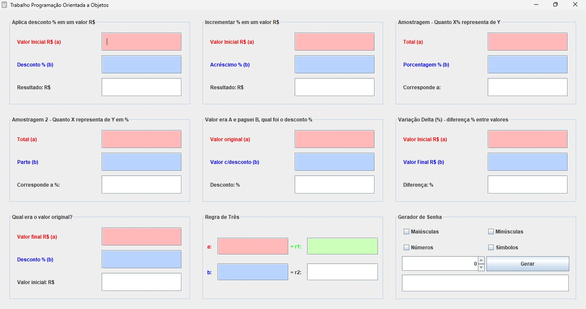

# 📊 Multi-Utility Calculator & Password Generator

Este projeto é uma **Calculadora Multiuso** desenvolvida em Java, com uma interface gráfica amigável. Ele oferece diversas funcionalidades, como realizar cálculos matemáticos comuns (descontos, acréscimos, regra de três, etc.) e gerar senhas seguras. Além disso, todas as respostas podem ser copiadas automaticamente para a área de transferência ao serem clicadas. 📋✨

## 👨‍🏫 Trabalho Acadêmico

Este trabalho foi desenvolvido como parte da disciplina de **Programação Orientada a Objetos**, pelos alunos:

- Leandro Thiago Ribeiro
- Bruno Michels Alves
- Enzo Rafael Conti de Souza
- Kediel Joás de Farias

## 🎯 Funcionalidades

### 🔢 Cálculos Diversos

- 📉 **Aplicar Desconto**: Calcula o valor após aplicar um percentual de desconto.
- 📈 **Aplicar Acréscimo**: Calcula o valor após aplicar um percentual de acréscimo.
- 📊 **Amostragem**: Calcula a porcentagem de um valor com base em outro valor.
- 🔄 **Variação Percentual**: Calcula a diferença percentual entre dois valores.
- 💵 **Valor Original**: Calcula o valor original com base no valor final e o percentual de desconto.
- 📐 **Regra de Três Simples**: Resolve cálculos de regra de três, útil para problemas de proporção.

### 🔐 Gerador de Senhas

- ✅ **Gerar Senhas Seguras**: Escolha diferentes tipos de caracteres (letras maiúsculas, minúsculas, números e símbolos).
- 🔢 **Personalizar o Tamanho da Senha**: Defina o comprimento desejado da senha gerada.
- 📋 **Copiar Senha**: A senha gerada pode ser copiada automaticamente para a área de transferência ao clicar no campo de senha.

### 📋 Função de Copiar Resultados

- Todas as respostas dos cálculos podem ser copiadas automaticamente para a área de transferência ao clicar no campo de resposta.
- O texto " - copiado!" será exibido como confirmação de que a ação foi realizada.

## 🚀 Como Usar

1. Clone o repositório:
   ```bash
   git clone https://github.com/LeandroTRibeiro/java-math-project.git
   ```

2. Importe o projeto para sua IDE preferida (como IntelliJ IDEA ou Eclipse).

3. Compile e execute o projeto.

4. Escolha a funcionalidade desejada:
   - **Desconto, Acréscimo, Amostragem, Variação Percentual, Valor Original, Regra de Três ou Gerador de Senhas**.

5. Preencha os campos necessários e pressione **Enter** para obter o resultado.

6. Clique no campo de resultado para copiar o valor gerado. O texto " - copiado!" aparecerá para confirmar a ação. 🎉

## 🛠 Tecnologias Utilizadas

- **Java Swing**: Interface gráfica para interagir com o usuário.
- **SecureRandom**: Utilizado para gerar senhas de forma segura.
- **JCheckBox, JSpinner, JButton, JTextField, JLabel**: Componentes da interface gráfica.
- **GridBagLayout e GridLayout**: Usados para organizar os componentes na tela.

## 📷 Captura de Tela



## 📄 Licença

Este projeto está licenciado sob a Licença MIT. Consulte o arquivo [LICENSE](LICENSE) para mais detalhes.

---

>📋 **Dica**: Todas as respostas podem ser copiadas automaticamente ao serem clicadas, tornando-o ainda mais fácil de usar!

---

>🔐 **Dica de Segurança**: Para senhas mais seguras, utilize uma combinação de letras maiúsculas, minúsculas, números e símbolos, além de definir um comprimento de pelo menos 12 caracteres.